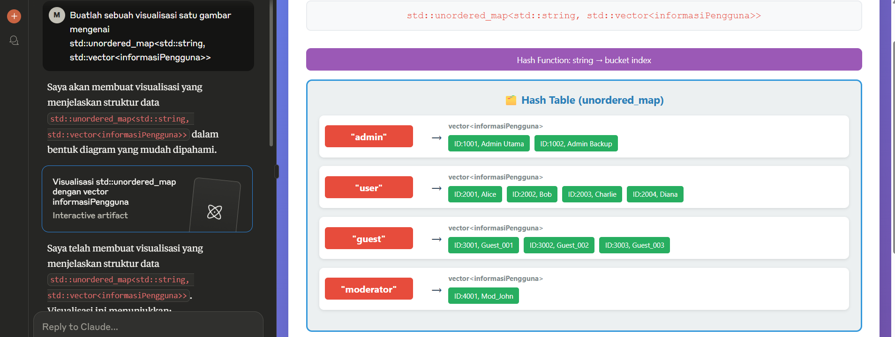

# Penjelasan Kode

Halo ini penjelasan berdasarkan perspektif saya ya teman-teman, kalau ada yang kurang paham bisa tanya ke aku atau AI.

## Bagian Include

```cpp
#include <iostream>
#include <vector>
#include <sstream>
#include <bits/stdc++.h>
#include <queue>
```

Bagian ini cuman include library yang dibutuhkan aja.
- iostream : buat std::cout, std::cin, dll.
- vector : kayak array tapi dinamis dan lebih mudah digunakan buat aku. Punya konsep kayak stack.
- sstream : ini buat baca per kata baris, ngebantu banget buat logika eksekusi command. Contoh:
```cpp
#include <iostream>
#include <sstream>
#include <string>

std::string myString = "PRINT ALL";

// kalau mau kata "PRINT" aja
std::stringstream ss(myString);
std::string command;
ss >> command;

std::cout << command; // "PRINT"
```
- <bits/stdc++.h> : ini jujur karena referensi ku ngawur, kalau pakai ini include kayak iostream, vector, dll itu gak perlu. Karena library ini udah punya kebanyakan library standar C++. Kelemahannya cuman kalau pakai compiler selain GNU gak bakalan bekerja.
-  Queue : ya [queue](https://www.geeksforgeeks.org/queue-data-structure/), kalian paham lah. Inget aja konsepnya FIFO (first in first out).

<br>

## Bagian Struct
```cpp
struct informasiPengguna
{
    std::string nama;
    int umur;
    std::vector<std::string> hobi;

    informasiPengguna()
    {
        nama = "anonymus";
        umur = 0;
        hobi = {"", "", ""};
    }

    informasiPengguna(std::string name, int age, std::vector<std::string> hobby)
    {
        nama = name;
        umur = age;
        hobi = hobby;
    }
};
```
Nah bagian ini tuh cuman **Tipe Data InformasiPengguna** yang isinya ada nama, usia dia, hobi (disimpan dalam bentuk vector karena bisa lebih dari 1). Gampangnya **struct ini menyimpan informasi pribadi pengguna Grukom.**

Ada *constructor default* yang secara default anonim, umur 0, dan vector hobi diisi kosong. Dan *parameterized constructor* buat isi nama, umur, dan hobi.

> [!IMPORTANT]  
> Inget ges, anggepannya kayak **tipe data** aja sih kurang lebih, kayak ***int*** kan buat nyimpan bilangan bulat, **informasiPengguna** buat simpan informasi pribadi seseorang 👍
<br>
## Bagian Class (Ada Konsep Graph)
Karena lumayan panjang, ku bahas pelan-pelan ya. Dimulai dari bagian Private dulu.

```cpp
std::vector<informasiPengguna> dataPengguna;
std::unordered_map<std::string, std::vector<informasiPengguna>> friendLists;
```
**vector dataPengguna** akan menyimpan **informasi pribadi (informasiPengguna) user yang terdaftar di Grukom**, jadi kalau belum kita ADD maka gak bakalan terdaftar di Grukom.

**std::unordered_map** jika divisualisasikan akan menjadi seperti ini:



kalian juga bisa baca-baca soal unordered_map [di sini](https://www.geeksforgeeks.org/unordered_map-in-cpp-stl/) yak.

intinya dia tuh nyimpan friendList dengan menerapkan konsep *Adjacency List* kurang lebih contohnya gini:

["Adit"] -> {"Farel", "Lukas", "Rein"} <br>
["Farel"] -> {"Adit", "Lukas", "Rein"}

Jadi kayak graph. Di mana seseorang bakalan menyimpan vector yang isinya informasi pengguna lain yang sudah ia koneksikan. Atau mudahnya, nyimpen data temannya.

Ini mempermudah banget, jadinya kita tinggal dapetin nama seseorang buat tahu siapa aja yang dia acc jadi temannya di Grukom.

### Private Section
<hr>

```cpp
   template <typename T>
    void swap(T &a, T &b)
    {
        auto temp = a;
        a = b;
        b = temp;
    }

    bool compareWords(std::string str1, std::string str2)
    {
        if (str1[0] == str2[0])
        {
            return str1 > str2;
        }

        return str1[0] > str2[0];
    }

    void bubbleSortNama(std::vector<informasiPengguna> &arr)
    {
        int size = arr.size();
        bool swapped;
        do
        {
            swapped = false;
            for (int i = 1; i <= size - 1; i++)
            {
                if (compareWords(arr[i - 1].nama, arr[i].nama))
                {
                    swap(arr[i - 1], arr[i]);
                    swapped = true;
                }
            }
        } while (swapped);
    }

    void bubbleSortUmur(std::vector<informasiPengguna> &arr)
    {
        int size = arr.size();
        bool swapped;
        do
        {
            swapped = false;
            for (int i = 1; i <= size - 1; i++)
            {
                if (arr[i - 1].umur < arr[i].umur)
                {
                    swap(arr[i - 1], arr[i]);
                    swapped = true;
                }
            }
        } while (swapped);
    }

    bool findNameInList(std::vector<informasiPengguna> arr, std::string nama)
    {
        bool found = false;
        for (informasiPengguna info : arr)
        {
            if (info.nama == nama)
            {
                found = true;
                break;
            }
        }

        return found;
    }

    informasiPengguna getPengguna(std::string name)
    {
        informasiPengguna temp;
        for (informasiPengguna info : dataPengguna)
        {
            if (info.nama == name)
            {
                temp = info;
                return temp;
            }
        }

        std::cout << "Tidak dapat menemukan pengguna!\n";
        return temp;
    }
```

Oke satu-satu: <br>
> 1. **Fungsi Swap**<br>
> Buat nuker nilai aja, simpel kok. Misal a = 10, b = 20. Kalau udah panggil fungsi `swap()` bakalan jadi a = 20, b = 10; Kenapa pakai template? Karena dalam konteks ini kita bakalan menukar nilai gak cuman bilangan bulat, tapi bisa aja string atau yang lain. Jadi pakai template biar bisa menyesuaikan. <br>
> Tambahan ada juga *reference* (&) di depan nama variabel. Analogi Sederhana: Tanpa & = Kasih fotokopi KTP ke orang → dia coret-coret fotokopi, KTP asli aman. Pakai & = Kasih KTP asli ke orang → dia coret-coret, KTP asli juga rusak
> 2. **compareWord**<br>
> Membandingkan dua string, berguna untuk mengurutkan berdasarkan abjad. Bakalan cek huruf paling depan masing-masing string dan dicek mana yang lebih dahulu di alfabet. Kalau keduanya sama, bakalan cek huruf selanjutnya.
> 3. **Bubble Sort**<br>
> Ada dua, Bubble Sort Nama, buat urutin nama sesuai dengan urutan alfabet, bubble sort umur buat urutin usia dari yang paling tua ke paling muda.
> Langkah-langkah algoritma bubble sort dengan `do-while` dari fungsi `bubbleSortNama` dan `bubbleSortUmur`:<br>

> 1. Hitung jumlah elemen dalam vektor dan simpan ke dalam variabel `size`.
> 2. Buat variabel boolean `swapped` sebagai penanda apakah terjadi pertukaran elemen dalam satu iterasi.
> 3. Masuki blok `do-while`:<br>
   a. Set `swapped = false` di awal iterasi, menandakan belum ada pertukaran.<br>
   b. Lakukan perulangan `for` dari indeks 1 sampai `size - 1`:
      - Bandingkan dua elemen berurutan: `arr[i - 1]` dan `arr[i]`.
      - Jika urutannya salah (misalnya nama tidak alfabetis atau umur lebih kecil di depan):
         i. Tukar posisi kedua elemen (`swap(arr[i - 1], arr[i])`).
         ii. Set `swapped = true`, menandakan bahwa masih ada data yang belum terurut.<br>
   c. Ulangi langkah ini selama `swapped == true`, yaitu selama masih ada elemen yang perlu ditukar.<br>
> 4. Ketika seluruh elemen sudah dalam urutan yang benar (tidak ada pertukaran dalam satu iterasi), maka `swapped == false` dan perulangan `do-while` berhenti.

> 4. findNameInList<br>
> Buat mencari nama dalam sebuah list. Berguna buat pengeeckan di fungsi `connectUser()` nanti. Bakalan melakukan iterasi sampai ketemu nama yang cocok sesuai yang diinginkan.
> 5. getPengguna<br>
> Mengembalikan struktur data `informasiPengguna` dari nama yang ingin didapatkan informasi penggunanya.

> [!IMPORTANT]  
> bagian `for (auto .. : list)` nanti bakalan banyak muncul, tenang ini adalah **range based loop** akan ekivalen dengan `for (int i = 0; i < arr.size(); i++)`. Jadi kalau mau mengubah sesuatu di dalam sebuah list, tinggal ubah menjadi `for (auto &... : list)`.

### Public Section
<hr>

```cpp
    bool findName(std::string name)
    {
        bool found = false;
        for (auto pengguna : dataPengguna)
        {
            if (pengguna.nama == name)
            {
                found = true;
                break;
            }
        }

        if (found)
        {
            return true;
        }
        else
        {
            return false;
        }
    }

    bool findHobi(std::string hobi)
    {
        for (informasiPengguna info : dataPengguna)
        {
            for (std::string hobby : info.hobi)
            {
                if (hobby == hobi)
                {
                    return true;
                }
            }
        }

        return false;
    }
```

Bagian ini sebenarnya helper aja, sesuai nama methodnya untuk menemukan apakah nama sesorang terdaftar atau belum dan menemukan apakah suatu hobi sudah terdaftar atau belum.

### Tambah Pengguna
<hr>

```cpp
void tambahPengguna(std::string name, int age, std::vector<std::string> hobby)
    {
        for (auto pengguna : dataPengguna)
        {
            if (pengguna.nama == name)
            {
                std::cout << "[ERROR] PENGGUNA TELAH TERDAFTAR!\n";
                return;
            }
        }

        informasiPengguna user(name, age, hobby);
        dataPengguna.push_back(user);
        friendLists[name] = {};

        std::cout << name << " BERHASIL DITAMBAH\n";
    }
```

Ini method untuk menambahkan atau akan dipanggila saat ada command `ADD`. Akan cek dulu di daftar pengguna, memastikan tidak ada pengguna dengan nama sama daftar dua kali.

Jika belum terdaftar, akan memasukan informasi pengguna baru tersebut ke struktur data informasiPengguna dan mendaftarkannya dengan method `push_back` vector. Kayak stack kok, mudah banget kan kalau pakai library?

kemudian set friendList milik dia saat ini masih kosong. Ya masa baru daftar udah ada follower atau teman? Bisa sih cuman dalam konteks Grukom ini tidak bisa dilakukan. Gambarannya, misal `ADD RIZKI`, maka di `friendList` :

```
["RIZKI"] -> {}
```
Masih kosong bro kecuali nanti dia kasih koneksi ke user lain.

### Hapus Pengguna
<hr>

```cpp
    void removePengguna(std::string name)
    {
        if (!findName(name))
        {
            std::cout << "[ERROR] TIDAK DAPAT MENEMUKAN PENGGUNA " << name << "!\n";
            return;
        }

        for (informasiPengguna teman : friendLists[name])
        {
            std::string namaTeman = teman.nama;
            std::vector<informasiPengguna> &daftarPertemananTeman = friendLists[namaTeman];
            if (findNameInList(daftarPertemananTeman, name))
            {
                for (int i = 0; i < daftarPertemananTeman.size(); i++)
                {
                    if (daftarPertemananTeman[i].nama == name)
                    {
                        daftarPertemananTeman.erase(daftarPertemananTeman.begin() + i);
                        break;
                    }
                }
            }
        }

        friendLists.erase(name);
        for (int i = 0; i < dataPengguna.size(); i++)
        {
            if (dataPengguna[i].nama == name)
            {
                dataPengguna.erase(dataPengguna.begin() + i);
                break;
            }
        }

        std::cout << name << " BERHASIL DIHAPUS" << "\n\n";
    }
```

Nah ini agak repot, jadi gini:

1. Cek apakah pengguna sudah terdaftar atau belum. Kalau belum terdaftar ngapain dihapus?
2. **Range Based loop** akan mendapatkan semua informasi pribadi teman dari si user yang mau kita hapus, misal tadi `ADIT` berteman sama kawannya, kita mau hapus `ADIT`.

```
REMOVE ADIT

-> Cek dlu Adit terdaftar apa ngga
iya? lanjut
ngga? Error

-> Ambil informasi temannya ADIT

-> for (informasiPengguna teman : friendLists[ADIT])
-> Dapatkan nama masing-masing teman,
teman.nama

-> Ambil informasi temannya si Teman
std::vector& daftarTemanTeman = friendLists[teman.nama]

Nah ini bakalan ngasih list pertemanan si temannya ADIT, kalau ketemu nama ADIT -> hapus dia dari pertemanan, karena kita mau hapus si ADIT.
```
3. Hapus dari graph si ADIT ini. jadi tadinya

```
[ADIT] -> {"Teman", "Teman", "Teman"}
[USER LAIN] -> {.....}

MENJADI

[USER LAIN] -> {.....}
```

4. Terakhir tinggal hapus dari daftarPengguna yang terdaftar, udah deh sukses REMOVE seseorang.

### Connect User
<hr>

```cpp
    void connectUser(std::string nama1, std::string nama2)
    {
        if (!findName(nama1) || !findName(nama2))
        {
            std::cout << "[ERROR] TIDAK DAPAT MENEMUKAN SALAH SATU ATAU KEDUA USER!\n\n";
            return;
        }

        std::vector<informasiPengguna> daftarPertemanan1 = friendLists[nama1];

        for (informasiPengguna info : daftarPertemanan1)
        {
            if (info.nama == nama2)
            {
                std::cout << "[ERROR] PENGGUNA " << nama1 << " DENGAN " << nama2 << " SUDAH SALING BERTEMAN!\n";
                return;
            }
        }

        friendLists[nama1].push_back(getPengguna(nama2));
        friendLists[nama2].push_back(getPengguna(nama1));

        std::cout << "Berhasil saling mengoneksikan user " << nama1 << " dengan " << nama2 << "\n\n";
    }
```

ini fungsi core terakhir, mengoneksikan antar user biar jadi graph.

1. Cek apakah kedua user terdaftar, kalau salah satu saja tidak terdaftar -> ERROR
2. Ambil daftar pertemanan salah satu pengguna, kemudian cek apakah kedua user udah saling berteman atau belum, kalau udah -> ERROR
3. Kalau belum di friendList mereka tambahkan orang yang mereka ingin koneksikan.

```
CONNECT RUSDI RIZAL

-> CEK TERDAFTAR (anggap dua-duanya udah)
-> UDAH TEMENAN (anggap belum)

anggap friendList masing-masing gini:
[RUSDI] -> {FARIS}
[RIZAL] -> {RONALDO, MESSI}

tambahkan ke friendlist
friendList[RUSDI].push_back(informasiPengguna RIZAL)
friendList[RIZAL].push_back(informasiPengguna RUSDI)

maka di friendList bakalan jadi:
[RUSDI] -> {FARIS, RIZAL}
[RIZAL] -> {RONALDO, MESSI, RUSDI}
```

### Closingan
<hr>

Aku yakin dari kalian pahamin beberapa konsep di atas kalian udah paham untuk kode-kode selanjutnya. Serius. Apalagi kalau udah hatam kali buat **Range Based Loop**. Sisanya kalau bingung jangan sungkan nanya atau GPT ges 👍